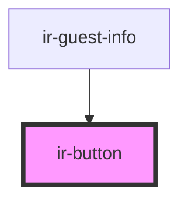

# ir-button

<!-- Auto Generated Below -->

## Properties

| Property       | Attribute      | Description | Type      | Default      |
| -------------- | -------------- | ----------- | --------- | ------------ |
| `btn_block`    | `btn_block`    |             | `boolean` | `true`       |
| `btn_color`    | `btn_color`    |             | `string`  | `'btn-info'` |
| `btn_disabled` | `btn_disabled` |             | `boolean` | `false`      |
| `btn_size`     | `btn_size`     |             | `string`  | `'btn-md'`   |
| `btn_type`     | `btn_type`     |             | `string`  | `'button'`   |
| `icon`         | `icon`         |             | `string`  | `'ft-save'`  |
| `name`         | `name`         |             | `string`  | `undefined`  |
| `text`         | `text`         |             | `any`     | `undefined`  |

## Events

| Event          | Description | Type               |
| -------------- | ----------- | ------------------ |
| `clickHanlder` |             | `CustomEvent<any>` |

## Dependencies

### Used by

 - [ir-guest-info](../ir-guest-info)

### Graph

----------------------------------------------

*Built with [StencilJS](https://stenciljs.com/)*
