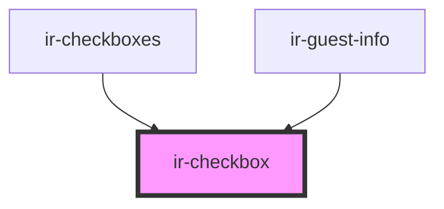

# ir-checkbox

<!-- Auto Generated Below -->

## Properties

| Property   | Attribute  | Description | Type      | Default     |
| ---------- | ---------- | ----------- | --------- | ----------- |
| `checked`  | `checked`  |             | `boolean` | `false`     |
| `disabled` | `disabled` |             | `boolean` | `false`     |
| `label`    | `label`    |             | `string`  | `'<label>'` |
| `name`     | `name`     |             | `string`  | `undefined` |
| `value`    | `value`    |             | `string`  | `undefined` |

## Events

| Event            | Description | Type                                                              |
| ---------------- | ----------- | ----------------------------------------------------------------- |
| `checkboxChange` |             | `CustomEvent<{ name: string; value: string; checked: boolean; }>` |

## Dependencies

### Used by

 - [ir-checkboxes](../ir-checkboxes)
 - [ir-guest-info](../ir-guest-info)

### Graph

----------------------------------------------

*Built with [StencilJS](https://stenciljs.com/)*
