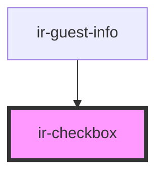

# ir-checkbox

<!-- Auto Generated Below -->

## Properties

| Property  | Attribute | Description | Type      | Default     |
| --------- | --------- | ----------- | --------- | ----------- |
| `checked` | `checked` |             | `boolean` | `false`     |
| `label`   | `label`   |             | `string`  | `'<label>'` |

## Events

| Event            | Description | Type                   |
| ---------------- | ----------- | ---------------------- |
| `checkboxChange` |             | `CustomEvent<boolean>` |

## Dependencies

### Used by

 - [ir-guest-info](../ir-guest-info)

### Graph

----------------------------------------------

*Built with [StencilJS](https://stenciljs.com/)*
