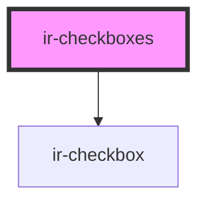

# ir-checkboxes

<!-- Auto Generated Below -->

## Properties

| Property     | Attribute | Description | Type           | Default |
| ------------ | --------- | ----------- | -------------- | ------- |
| `checkboxes` | --        |             | `checkboxes[]` | `[]`    |

## Events

| Event              | Description | Type                        |
| ------------------ | ----------- | --------------------------- |
| `checkboxesChange` |             | `CustomEvent<checkboxes[]>` |

## Dependencies

### Depends on

- [ir-checkbox](../ir-checkbox)

### Graph

----------------------------------------------

*Built with [StencilJS](https://stenciljs.com/)*
