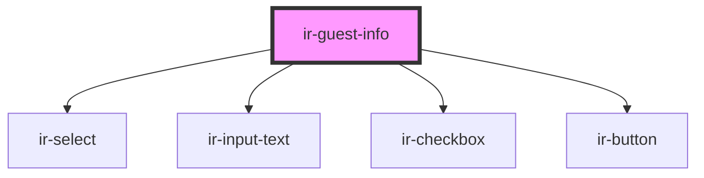

# ir-guest-info

<!-- Auto Generated Below -->

## Properties

| Property                 | Attribute | Description | Type             | Default |
| ------------------------ | --------- | ----------- | ---------------- | ------- |
| `data`                   | --        |             | `guestInfo`      | `null`  |
| `setupDataCountries`     | --        |             | `selectOption[]` | `null`  |
| `setupDataCountriesCode` | --        |             | `selectOption[]` | `null`  |

## Events

| Event          | Description | Type                     |
| -------------- | ----------- | ------------------------ |
| `getSetupData` |             | `CustomEvent<any>`       |
| `submitForm`   |             | `CustomEvent<guestInfo>` |

## Dependencies

### Depends on

- [ir-select](../ir-select)
- [ir-input-text](../ir-input-text)
- [ir-checkbox](../ir-checkbox)
- [ir-button](../ir-button)

### Graph

----------------------------------------------

*Built with [StencilJS](https://stenciljs.com/)*
