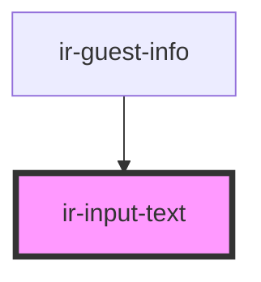

# ir-input-text

<!-- Auto Generated Below -->

## Properties

| Property         | Attribute         | Description | Type      | Default           |
| ---------------- | ----------------- | ----------- | --------- | ----------------- |
| `LabelAvailable` | `label-available` |             | `boolean` | `true`            |
| `label`          | `label`           |             | `string`  | `'<label>'`       |
| `placeholder`    | `placeholder`     |             | `string`  | `'<placeholder>'` |
| `required`       | `required`        |             | `boolean` | `undefined`       |
| `text`           | `text`            |             | `any`     | `undefined`       |
| `type`           | `type`            |             | `string`  | `'text'`          |

## Events

| Event        | Description | Type               |
| ------------ | ----------- | ------------------ |
| `textChange` |             | `CustomEvent<any>` |

## Dependencies

### Used by

 - [ir-guest-info](../ir-guest-info)

### Graph

----------------------------------------------

*Built with [StencilJS](https://stenciljs.com/)*
