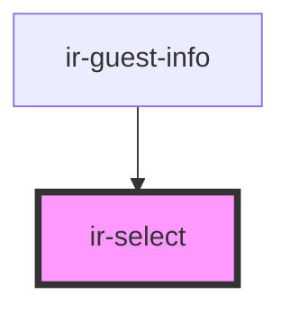

# ir-select

<!-- Auto Generated Below -->

## Properties

| Property         | Attribute         | Description | Type             | Default     |
| ---------------- | ----------------- | ----------- | ---------------- | ----------- |
| `LabelAvailable` | `label-available` |             | `boolean`        | `true`      |
| `data`           | --                |             | `selectOption[]` | `undefined` |
| `firstOption`    | `first-option`    |             | `string`         | `'Select'`  |
| `label`          | `label`           |             | `string`         | `'<label>'` |
| `name`           | `name`            |             | `string`         | `undefined` |
| `required`       | `required`        |             | `boolean`        | `undefined` |
| `selectStyle`    | `select-style`    |             | `boolean`        | `true`      |
| `selectedValue`  | `selected-value`  |             | `any`            | `null`      |
| `submited`       | `submited`        |             | `boolean`        | `false`     |

## Events

| Event          | Description | Type               |
| -------------- | ----------- | ------------------ |
| `selectChange` |             | `CustomEvent<any>` |

## Dependencies

### Used by

 - [ir-guest-info](../ir-guest-info)

### Graph

----------------------------------------------

*Built with [StencilJS](https://stenciljs.com/)*
