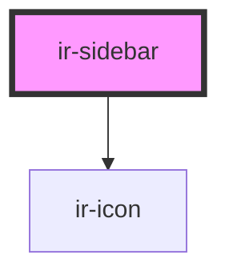

# ir-sidebar

<!-- Auto Generated Below -->

## Properties

| Property | Attribute | Description | Type                | Default     |
| -------- | --------- | ----------- | ------------------- | ----------- |
| `name`   | `name`    |             | `string`            | `undefined` |
| `open`   | `open`    |             | `boolean`           | `false`     |
| `side`   | `side`    |             | `"left" \| "right"` | `undefined` |

## Methods

### `toggleSidebar() => Promise<void>`

#### Returns

Type: `Promise<void>`

## Dependencies

### Depends on

- [ir-icon](../ir-icon)

### Graph

----------------------------------------------

*Built with [StencilJS](https://stenciljs.com/)*
